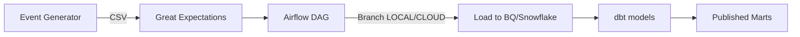

# Architecture

- Airflow DAG: `nimbusflow_ingest_dbt_publish` with branch `LOCAL` vs `CLOUD`.
- Data quality via Great Expectations.
- dbt models for staging and marts, plus tests.
- Terraform for GCP and Snowflake.
